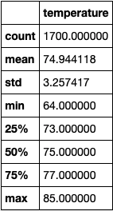
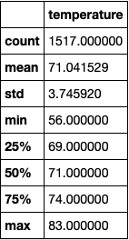
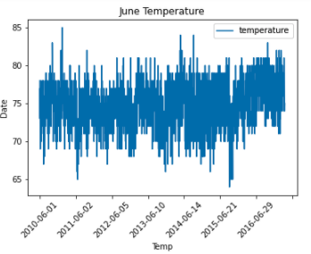
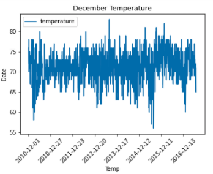

# Surfs_Up Analysis

## Overview
Per SQL database provided by W. Avy, analysis was done using both Jupyter Notebook, SQLAlchemy, and Flask on precipitation and temperature in Oahu in order to determine whether it is ideal to open a surfing and ice cream business for all year round.

## Results
- Per analysis on month of June, we can see that the average temperature on June is around 75 degrees farenheit where the highiest was 85 degrees farenheit.
### 
- Per analysis on month of December, we can see that the average temperature on December is around 71 degrees farenehit where the highest was 83 degress farenheit.
### 

## Summary
- With the analysis done on temperatures on both June and December, it seems it is ideal to run a surfing and ice cream business on Oahu since temperatures on are not showing a significant difference.
- Below are some extra queries that can be used to show the trend of temperatures on June and December by visualizing the data as a plot.
### Query and plot to show temperature trend of June
June_df = June_df.sort_index()
print(June_df.to_string(index=False))
June_df.plot()
plt.title('June Temperature')
plt.xlabel('Temp')
plt.ylabel('Date')
plt.xticks(rotation=45)
### 

### Query and plot to show temperature trend of December
Dec_df = Dec_df.sort_index()
print(Dec_df.to_string(index=False))
Dec_df.plot()
plt.title('December Temperature')
plt.xlabel('Temp')
plt.ylabel('Date')
plt.xticks(rotation=45)
### 
